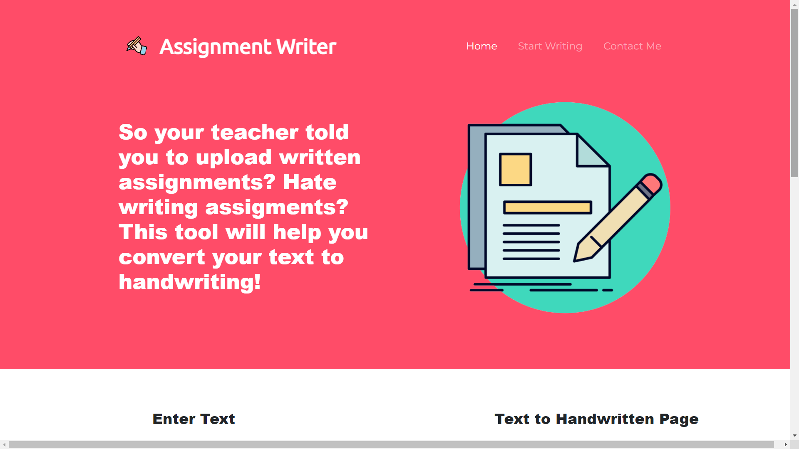
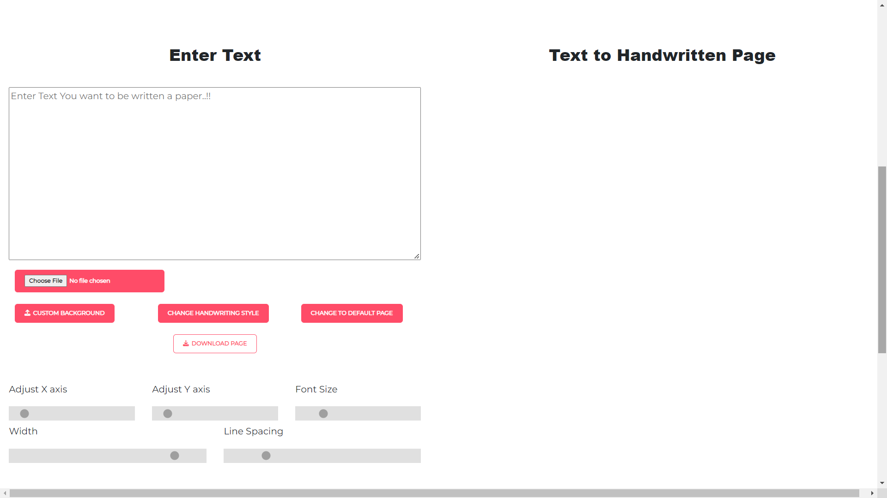

# Assignment_Writer

<h3>v1.0 : A website that converts text into handwritten notes that can be downloaded as pdf.   Made using HTML, CSS, Bootstrap, JavaScript and Python.</h3>

<h3>v2.0 : Added support for using custom handwriting and paper can be added.</h3>
<h3>v2.1 : Adding support for adjusting spacing and margin according to user needs</h3>

 
 

 
 
 

